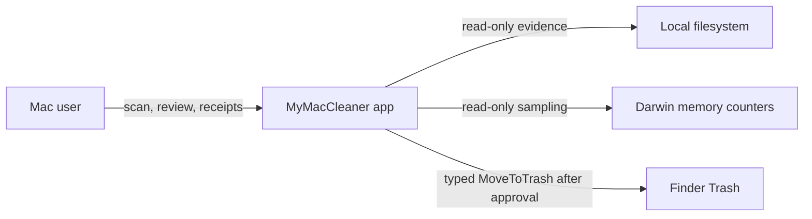
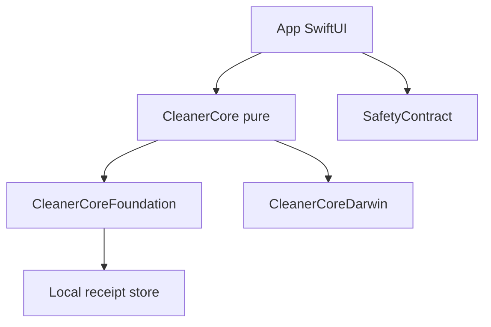
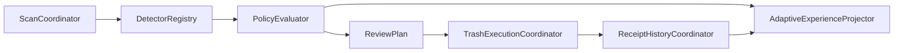

# C4 architecture

Source-grounded C4 views for MyMacCleaner. These diagrams describe the current
Command Line Tools checkout. They do not claim a signed or notarized product.

Status labels used below:

- **Implemented** — code exists in this tree
- **Locally verified** — SwiftPM or script evidence exists on this machine
- **Pending** — full Xcode, hosted CI, signing, or a human walk is required

## L1 — System context

MyMacCleaner is an offline-first macOS storage and memory assistant. A person
inspects local evidence, reviews an immutable plan, and may move eligible items
to Trash. There is no account, telemetry, or cloud classification path in the
trust pipeline.

| Actor | Relationship | Code anchor |
|-------|--------------|-------------|
| Mac user | SwiftUI sidebar and Adaptive Experience | `MyMacCleaner/App/ContentView.swift`, `MyMacCleaner/Features/AdaptiveExperience/` |
| Local filesystem | Injected Foundation adapter; six declared general-Mac roots | `CleanerCore/Sources/CleanerCoreFoundation/`, `GeneralMacScopeCatalog` |
| Darwin | Read-only memory observation | `CleanerCore/Sources/CleanerCoreDarwin/DarwinMemoryObservationAdapter.swift` |
| Finder Trash | Sole mutation: Foundation `trashItem` after revalidation | `FoundationTrashAdapter.swift`, `MoveToTrash.swift` |

## L2 — Containers

| Container | Responsibility | Location |
|-----------|----------------|----------|
| App shell | Navigation, Adaptive Experience, Home/Disk live scan bridge | `MyMacCleaner/` |
| CleanerCore | Evidence, policy, plans, execution types, receipts, projection | `CleanerCore/Sources/CleanerCore/` |
| CleanerCoreFoundation | Filesystem observation, Trash adapter, receipt persistence, developer presence | `CleanerCore/Sources/CleanerCoreFoundation/` |
| CleanerCoreDarwin | Memory pressure and process observation | `CleanerCore/Sources/CleanerCoreDarwin/` |
| SafetyContract | Disabled privileged operations, redaction, process allowlist | `SafetyContract/Sources/SafetyContract/` |
| Local store | Application Support receipt journal | `AppSupportReceiptStore.swift` |

## L3 — Components (scan to receipt)

Journey:

1. `AdaptiveScanSession` / `ScanCoordinator` runs only shipped detectors.
2. `GeneralMacEvidenceDetector` and model-inventory parsers emit immutable findings.
3. `PolicyEvaluator` assigns disposition and eligibility (`PolicyEvaluation.swift`).
4. `ReviewPlan` is digest-bound; `ApprovalValidity` is recomputed, not stored as a reusable token.
5. `ApprovedTrashOperationFactory` may construct `MoveToTrash`; `FreshEvidenceRevalidator` compares frozen fields.
6. `TrashExecutionCoordinator` calls the Trash port once per item; `FoundationTrashAdapter` is the sole adapter.
7. `ReceiptHistoryCoordinator` journals intent, records outcomes, retains 90 days / 500 terminal receipts.
8. `AdaptiveExperienceProjector` maps one snapshot into Guided/Standard/Technical copy without changing authority.

AI/ML and developer inventory stay on this path as **inventory-only** cards. They cannot construct `MoveToTrash`.

## L4 — Code anchors

| Step | Type / function | File |
|------|-----------------|------|
| Scan loop | `ScanCoordinator.nextBatch` | `CleanerCore/Sources/CleanerCore/Scanning/ScanCoordinator.swift` |
| Registry | `DetectorRegistry.resolve` | `CleanerCore/Sources/CleanerCore/Scanning/DetectorRegistry.swift` |
| General-Mac evidence | `GeneralMacEvidenceDetector` | `CleanerCore/Sources/CleanerCore/Detectors/GeneralMac/GeneralMacEvidenceDetector.swift` |
| Hugging Face inventory | `HuggingFaceCacheParser` | `CleanerCore/Sources/CleanerCore/ModelInventory/HuggingFaceCacheParser.swift` |
| Policy | `PolicyEvaluator.evaluate` | `CleanerCore/Sources/CleanerCore/Policy/PolicyEvaluator.swift` |
| Plan | `ReviewPlan` | `CleanerCore/Sources/CleanerCore/Plans/ReviewPlan.swift` |
| Approval | `ApprovalValidity` | `CleanerCore/Sources/CleanerCore/Plans/ApprovalValidity.swift` |
| Operation | `MoveToTrash` | `CleanerCore/Sources/CleanerCore/Execution/MoveToTrash.swift` |
| Revalidation | `FreshEvidenceRevalidator` | `CleanerCore/Sources/CleanerCore/Execution/FreshEvidenceRevalidator.swift` |
| Execute | `TrashExecutionCoordinator` | `CleanerCore/Sources/CleanerCore/Execution/TrashExecutionCoordinator.swift` |
| Trash adapter | `FoundationTrashAdapter` | `CleanerCore/Sources/CleanerCoreFoundation/FoundationTrashAdapter.swift` |
| Receipts | `ReceiptHistoryCoordinator`, `ReceiptRetention` | `CleanerCore/Sources/CleanerCore/Receipts/` |
| Store | `AppSupportReceiptStore` | `CleanerCore/Sources/CleanerCoreFoundation/AppSupportReceiptStore.swift` |
| Reveal | `FinderReceiptRevealAdapter` | `CleanerCore/Sources/CleanerCoreFoundation/FinderReceiptRevealAdapter.swift` |
| UI projection | `AdaptiveExperienceProjector` | `CleanerCore/Sources/CleanerCore/Presentation/AdaptiveExperienceProjection.swift` |
| Live scan bridge | `CleanerCoreLiveScan` | `MyMacCleaner/Core/Services/CleanerCoreLiveScan.swift` |
| Developer presence | `DeveloperInventoryRegistry` | `CleanerCore/Sources/CleanerCore/DeveloperInventory/DeveloperInventoryRegistry.swift` |
| Disabled ops | `DisabledOperationGateway` | `SafetyContract/Sources/SafetyContract/DisabledOperationGateway.swift` |
| Memory | `DarwinMemoryObservationAdapter` | `CleanerCore/Sources/CleanerCoreDarwin/DarwinMemoryObservationAdapter.swift` |

Adaptive Experience presentation (`AdaptiveSafeIntent`) exposes refresh, cancel, onboarding, focus, permission help, receipt-sheet open, and a digest-bound approve/confirm. Confirm passes the digest the user reviewed to `AdaptiveTrustSession.executeDisplayedPlan`; `ApprovalValidity` rejects it if the displayed plan changed. Trash moves resolve only `userLibraryCaches` roots (`AdaptiveTrustSession.trashEligibleRootKinds`); fresh evidence is formed only for a regular file under `GeneralMacScopeProof.namedCacheComponent` (`AdaptiveTrustSession.isWithinTrashScope`) that a fresh scan still finds policy-eligible (`FreshTargetEvidence.observing(target:eligibleIn:)`). Session failures surface as `AdaptiveSessionFailure`.

### Evidence-only legacy scanners

These features intentionally stay outside CleanerCore because it has no matching detector or scope. They are read-only: their cleanup and delete routes were removed in Phase 0 and any cleanup request goes through `DisabledOperationGateway`.

| Feature | Scanner | File |
|---------|---------|------|
| Space Lens | `SpaceLensViewModel.buildFileTree` (off main actor, cancellable, 500,000-entry cap) | `MyMacCleaner/Features/SpaceLens/SpaceLensViewModel.swift` |
| Duplicates | `DuplicateScanner` (any chosen folder; CleanerCore `DuplicateTriage` covers only Downloads/Desktop/Documents) | `MyMacCleaner/Core/Services/DuplicateScanner.swift` |
| Orphaned Files | `OrphanedFilesScanner` | `MyMacCleaner/Core/Services/OrphanedFilesScanner.swift` |
| Browser Privacy | `BrowserCleanerService` (inventory only) | `MyMacCleaner/Core/Services/BrowserCleanerService.swift` |

The former `FileScanner` was retired; Home and Disk Cleaner scan only through `CleanerCoreLiveScan`.

## Trust boundaries

See [THREAT-MODEL.md](THREAT-MODEL.md). The UI may change explanation depth. It must not change scan scope, eligibility, or mutation authority.
